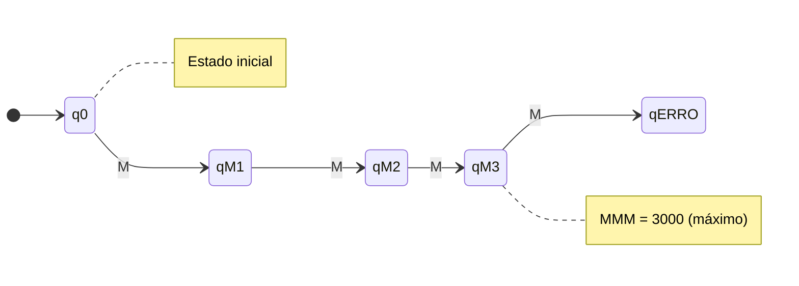
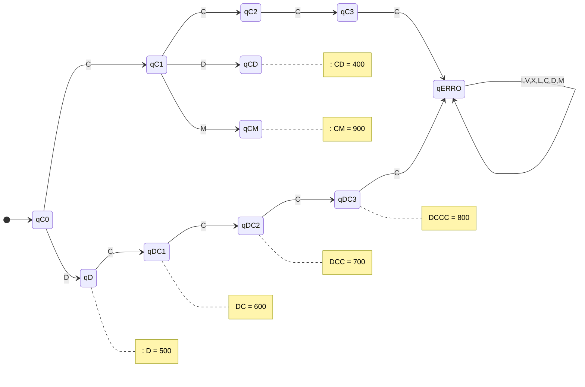
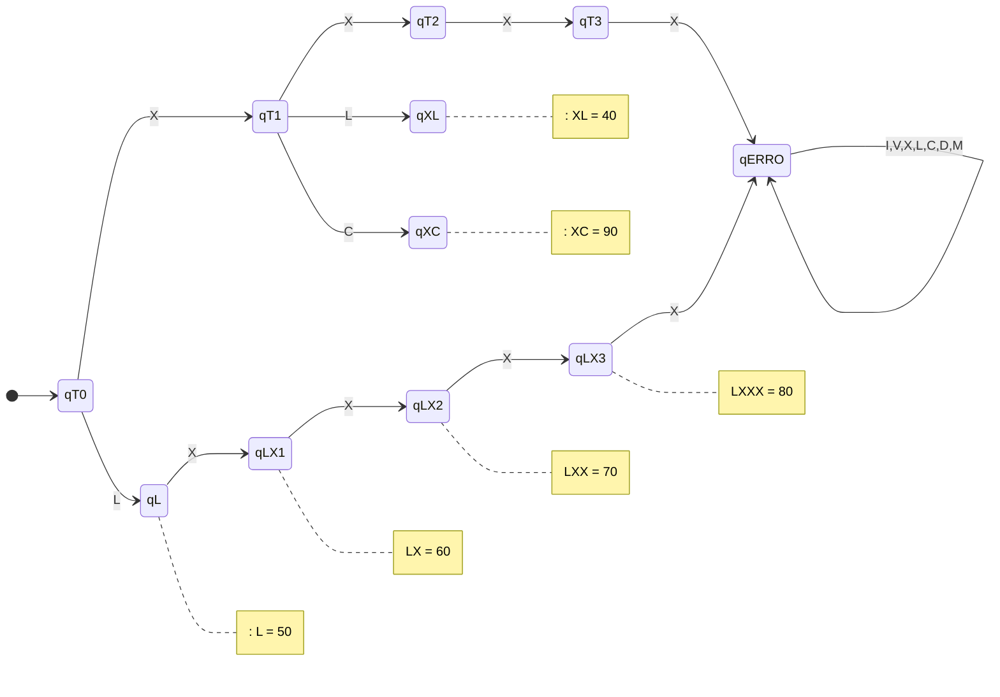
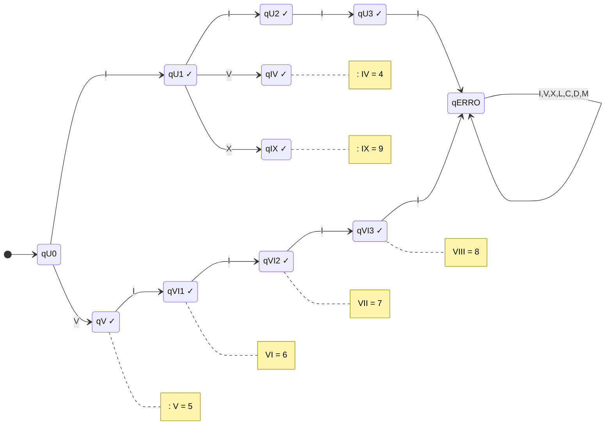
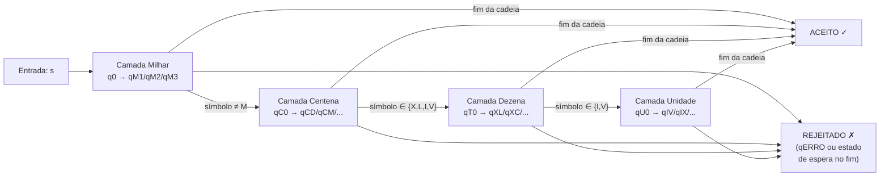

# Diagrama do AFD — Conversor de Números Romanos

O diagrama abaixo representa o Autômato Finito Determinístico (AFD) organizado em
quatro camadas sequenciais: milhar → centena → dezena → unidade.

Para clareza visual, o diagrama é dividido por camada. As setas entre camadas
representam o redirecionamento do próximo símbolo para a camada seguinte.

---

## Camada 1 — Milhar

---

## Camada 2 — Centena

---

## Camada 3 — Dezena

---

## Camada 4 — Unidade

---

## Visão geral — fluxo entre camadas

---

## Notas sobre o diagrama

1. **Estados de aceitação**: marcados com `✓` na camada de unidade; nas camadas
   anteriores, qualquer estado (exceto `qERRO` e estados de "espera" `qC0`, `qT0`, `qU0`)
   é de aceitação quando a cadeia termina nele.

2. **Transições implícitas para qERRO**: qualquer símbolo não listado em um estado
   leva implicitamente a `qERRO`. O estado `qERRO` é um sumidouro: todas as suas
   transições retornam a ele mesmo.

3. **Redirecionamento entre camadas**: quando a camada de milhar recebe um símbolo
   que não é `M`, ela passa o controle para a camada de centena com esse símbolo.
   O mesmo padrão se repete entre centena→dezena e dezena→unidade.
